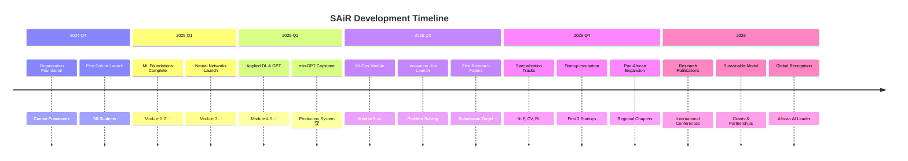

# 🇸🇩 SAiR – Sudanese Artificial Intelligence Research Organization

<div align="center">

<!-- Hero Banner -->


<br/>

<!-- Dynamic Badges Grid -->
<table>
<tr>
<td align="center">
<a href="https://t.me/+jPPlO6ZFDbtlYzU0">

</a>
</td>
<td align="center">
<a href="https://github.com/SAIR-Org/SAIR_Jr">

</a>
</td>
<td align="center">
<a href="https://github.com/SAIR-Org/miniGPT">

</a>
</td>
<td align="center">

</td>
</tr>
</table>

<br/>

<!-- Mission Statement -->
<h3>

Building Sudan's AI Talent Pipeline from First Principles to Production

</h3>

**Founded:** December 2024 | **Last Updated:** March 2026  
**Founder & CEO:** [Mohammed Awad Ahmed (Silva)](https://www.linkedin.com/in/maas-ai)

</div>

---

## 📖 Table of Contents

- [👨‍💼 Meet the Founder](#-meet-the-founder)
- [🌍 About SAiR](#-about-sair)
- [🏛️ Organization Architecture](#️-organization-architecture)
- [📚 SAiR Jr. Curriculum](#-sair-jr-curriculum)
- [🏆 Capstone: miniGPT](#-capstone-minigpt)
- [🎯 Mission, Vision & Values](#-mission-vision--values)
- [📊 Impact Metrics](#-impact-metrics--progress)
- [🌐 Join the SAiR Community](#-join-the-sair-community)
- [🚀 Roadmap & Future Vision](#-roadmap--future-vision)
- [📜 Open Source](#-open-source--contribution)
- [💬 Contact & Support](#-contact--support)

---

## 👨‍💼 Meet the Founder

<div align="center">


<br/><br/>

<!-- Founder Links Grid -->
<table>
<tr>
<td align="center" width="33%">
<a href="https://www.linkedin.com/in/maas-ai">

<br/><br/>

<br/><br/>
<strong>Professional Profile</strong><br/>
Connect on LinkedIn
</a>
</td>
<td align="center" width="33%">
<a href="https://github.com/silvaxxx1">

<br/><br/>

<br/><br/>
<strong>@silvaxxx1</strong><br/>
Open Source Work
</a>
</td>
<td align="center" width="33%">
<a href="https://silvaxxx1.github.io/MyWebsite/">

<br/><br/>

<br/><br/>
<strong>Personal Website</strong><br/>
Projects & Research
</a>
</td>
</tr>
</table>

<br/>

<!-- Vision Quote Box -->
<table>
<tr>
<td>

</td>
<td>
<h3 align="left">Founder's Vision</h3>
<p align="left">
<em>"I believe talent is equally distributed, but opportunity is not. SAiR exists to change that equation for Sudanese and African AI enthusiasts. We're building more than just courses - we're creating a pipeline that transforms learners into innovators who can solve real-world problems."</em>
</p>
</td>
</tr>
</table>

</div>

**Mohammed Awad Ahmed (Silva)** is a Sudanese AI engineer, researcher, and passionate educator dedicated to democratizing artificial intelligence education in Sudan and across Africa. With expertise in both theoretical foundations and practical applications, he founded SAiR to create a sustainable AI ecosystem that nurtures local talent and prepares them for global challenges.

### 🏆 Key Achievements

- 🎓 **200+ Students Trained** across multiple AI/ML courses
- 📚 **5 Complete Modules** delivered with high completion rates
- 🚀 **Full GPT Implementation** from scratch (miniGPT capstone)
- 🌍 **Building Pan-African AI Community** from Sudan
- 🧠 **39+ Tests** passing on production-grade code

---

## 🌍 About SAiR

<div align="center">

<!-- SAiR Logo Concept -->


<br/><br/>

<!-- Quick Stats -->
<table>
<tr>
<td align="center">

</td>
<td align="center">

</td>
<td align="center">

</td>
<td align="center">

</td>
</tr>
</table>

<br/>

<!-- Current Focus Cards -->
<table>
<tr>
<td width="50%" valign="top">
<div align="center">

### 🎯 Current Focus
**SAiR Jr. Program: Building AI Engineers**


</div>

We've completed **5 out of 6 modules** of the SAiR Jr. Certification Track. Students have built everything from regression models to a full GPT implementation from scratch.

**Achievements:**
- ✅ 5 Modules Complete (0–5)
- ✅ 1 Full Production Capstone ([miniGPT](https://github.com/SAIR-Org/miniGPT))
- ✅ 200+ Active Learners
- 🔜 Module 6: MLOps (Coming Soon)

</td>
<td width="50%" valign="top">
<div align="center">

### 🚀 Future Vision
**Complete AI Ecosystem**


</div>

Creating a self-sustaining AI ecosystem in Sudan where education leads to research, innovation leads to solutions, and talent leads to global impact.

**Roadmap:**
- 🔜 MLOps Module Launch
- 🔜 Research Publications
- 🔜 Innovation Hub Launch
- 🔜 Pan-African Expansion

</td>
</tr>
</table>

</div>

### 🎓 What Makes SAiR Different?

<table>
<tr>
<td width="25%" align="center">

<br/><strong>Build From Scratch</strong><br/>
<small>We don't just import libraries — we build them</small>
</td>
<td width="25%" align="center">

<br/><strong>Completely Free</strong><br/>
<small>No tuition fees, no hidden costs</small>
</td>
<td width="25%" align="center">

<br/><strong>Strong Community</strong><br/>
<small>Peer support and mentorship</small>
</td>
<td width="25%" align="center">

<br/><strong>African Context</strong><br/>
<small>Solving local challenges</small>
</td>
</tr>
</table>

---

## 🏛️ Organization Architecture

<div align="center">

```
┏━━━━━━━━━━━━━━━━━━━━━━━━━━━━━━━━━━━━━━━━━━━━━━━━━━━━━━━━━━━━━━┓
┃                  🌐 SAiR ORGANIZATION                           ┃
┃              Building Sudan's AI Future Together                ┃
┗━━━━━━━━━━━━━━━━━━━━━━━━━━━━━━━━━━━━━━━━━━━━━━━━━━━━━━━━━━━━━━┛
                              │
        ┌─────────────────────┼─────────────────────┐
        │                     │                     │
        ▼                     ▼                     ▼
┌──────────────────┐ ┌──────────────────┐ ┌──────────────────┐
│   📚 EDUCATION   │ │  🧪 RESEARCH LAB │ │ 💡 INNOVATION HUB│
│  (Current Focus) │ │     (Future)     │ │     (Future)     │
└──────────────────┘ └──────────────────┘ └──────────────────┘
        │                     │                     │
        ├─ 🎓 SAiR Jr. ✅     ├─ 📄 Publications   ├─ 🏗️ Solutions
        ├─ 🚀 Projects        ├─ 🔓 Open Source    ├─ 🚀 Startups
        ├─ 👥 Community       ├─ 🤝 Collaborations ├─ 🤖 Edge AI
        └─ 💼 Portfolio       └─ 🎓 Mentorship     └─ 🌍 Africa Focus
                              │
                              ▼
                    ┌──────────────────┐
                    │ 🌍 SAiR COMMUNITY│
                    │  The Heart of AI │
                    └──────────────────┘
                              │
                    ├─ 💬 Networks (500+)
                    ├─ 👨‍🏫 Mentorship
                    ├─ 🏆 Competitions
                    └─ 🔗 Industry Links
```

</div>

---

## 📚 SAiR Jr. Curriculum

<div align="center">

### 🎓 SAiR Jr. Certification Track: From Zero to AI Engineer


<br/><br/>

<!-- Complete Module Table -->
<table>
<thead>
<tr>
<th width="12%">Module</th>
<th width="28%">What You'll Learn</th>
<th width="12%">Status</th>
<th width="18%">Build & Deploy</th>
<th width="30%">Key Achievement</th>
</tr>
</thead>
<tbody>
<tr>
<td align="center"><strong>0 🐍</strong></td>
<td><strong>Python for Data Science</strong><br/><em>NumPy, Pandas, Visualization</em></td>
<td align="center">✅ Complete</td>
<td>Data analysis scripts</td>
<td>Data wrangling mastery</td>
</tr>
<tr>
<td align="center"><strong>1 📈</strong></td>
<td><strong>Your First ML Model</strong><br/><em>Regression, Scikit-learn</em></td>
<td align="center">✅ Complete</td>
<td>Deployed prediction API</td>
<td>End-to-end ML pipeline</td>
</tr>
<tr>
<td align="center"><strong>2 🎯</strong></td>
<td><strong>Production ML Systems</strong><br/><em>Classification, Pipelines</em></td>
<td align="center">✅ Complete</td>
<td>End-to-end ML pipeline</td>
<td>Production thinking</td>
</tr>
<tr>
<td align="center"><strong>3 🧠</strong></td>
<td><strong>Neural Networks Deep Dive</strong><br/><em>Built from scratch, Math</em></td>
<td align="center">✅ Complete</td>
<td>Custom neural network library</td>
<td>Fundamental understanding</td>
</tr>
<tr>
<td align="center"><strong>4 🔥</strong></td>
<td><strong>Applied Deep Learning</strong><br/><em>PyTorch, CNN, RNN, Transformers</em></td>
<td align="center">✅ Complete</td>
<td>Vision apps, NLP pipelines</td>
<td>Modern AI development</td>
</tr>
<tr style="background-color: #E8F5E9;">
<td align="center"><strong>5 🧠</strong></td>
<td><strong>GPT from Scratch</strong><br/><em>Attention, transformer, SFT</em></td>
<td align="center">✅ <strong>Complete</strong></td>
<td><a href="https://github.com/SAIR-Org/miniGPT">miniGPT</a> — full GPT system</td>
<td>LLM implementation from scratch</td>
</tr>
<tr>
<td align="center"><strong>6 ⚙️</strong></td>
<td><strong>MLOps</strong><br/><em>Docker, FastAPI, MLflow, CI/CD</em></td>
<td align="center">🔜 <strong>Coming Soon</strong></td>
<td>Production ML system</td>
<td>Full deployment lifecycle</td>
</tr>
</tbody>
</table>

</div>

### 🔥 Module 5: GPT from Scratch — The Capstone

<div align="center">

<table>
<tr>
<td width="60%" valign="top">

#### 📖 Learning Journey: 8 Notebooks

**5 Core Notebooks:**
1. **Data & Tokenization** — Custom tokenizer + tiktoken BPE
2. **Attention Mechanisms** — Multi-head causal attention from scratch
3. **GPT Architecture** — 124M-parameter GPT-2 implementation
4. **Training Loop** — V0→V4 with DDP and mixed precision
5. **Inference** — Greedy, temperature, top-k, beam search

**3 Appendix Notebooks:**
- A0: PyTorch Crash Course
- A1: SFT for Text Classification
- A2: SFT for Instruction Following

</td>
<td width="40%" valign="top">

#### 🏆 What Students Build

**miniGPT — Full Production System:**
- 🖥️ `sair` CLI with 4+ commands
- ☁️ Modal cloud training (A100)
- 📊 W&B integration + loss plots
- 🌐 Web UI (Gradio)
- 🧪 39 passing tests
- 🔧 Fine-tuning pipelines

</td>
</tr>
</table>

</div>

---

## 🏆 Capstone: miniGPT

<div align="center">

<p align="center">
  
</p>

<h2 align="center">SAIR miniGPT</h2>

<p align="center">
  <b>Build a GPT. Train it. Talk to it.</b><br/>
  A full-stack, hackable GPT playground — from raw text to a live web UI.
</p>

<p align="center">
  <a href="https://github.com/SAIR-Org/miniGPT">
    
  </a>
  <a href="https://github.com/SAIR-Org/SAIR_Jr/tree/main/5_GPT%20from%20scratch">
    
  </a>
  
  
  
</p>

</div>

### ⚡ Quick Start — Modal Cloud Run (3 steps)

```bash
# 1. Train on Modal A100 (~3 hrs, ~$12–15)
uv run python -m modal run train/modal_train.py::main

# 2. Download the final checkpoint to your machine
uv run python -m modal run train/modal_train.py::download

# 3. Launch the web UI and demo it live
uv run sair ui        # → http://localhost:7860
```

### 🎯 What miniGPT Delivers

| Feature | What it does |
| --- | --- |
| 🖥️ **`sair` CLI** | Go from raw text to trained model in a few commands |
| 📄 **Multi-format data** | `.txt` and `.pdf` files as training data |
| ☁️ **Flexible training** | Local CPU/GPU · Modal A100 cloud · multi-GPU DDP |
| 📊 **W&B + plots** | Live loss curves in your browser + PNG saved after training |
| 🌐 **Web UI** | Chat with your model in the browser |
| 🚀 **Pretrained models** | Load GPT-2 (124M → 1.5B) without training |

### 📊 Real Training Example — Harry Potter

**Run: medium model, 30 epochs**

- **Setup:** `medium` preset (~163M params, 1024 context) · Modal A100
- **Data:** 6 Harry Potter books
- **Cost:** ~$12–15 · ~3 hrs total
- **Result:** Full GPT-2 style model generating coherent Harry Potter text

### 🧪 Testing

```bash
uv run python -m pytest tests/ -v
```
```
39 passed in 8.65s
```

### 📁 miniGPT Project Structure

```
miniGPT/
├── config.py               ← all hyperparams
├── cli.py                  ← sair prepare | train | generate | ui
├── data/                   ← data preparation & dataset
├── model/                  ← GPTModel: LayerNorm → MHA → FFN → Block
├── train/                  ← trainerV3, DDP, Modal cloud
├── inference/              ← generateV0→V3, weight loading
├── ui/                     ← FastAPI backend + SAIR-branded web UI
├── finetune/               ← SFT for classification & instruction
├── tests/                  ← 39 tests covering full pipeline
└── ui_finetune/            ← fine-tuning web interface
```

> 📖 **Full documentation:** [miniGPT GitHub Repository](https://github.com/SAIR-Org/miniGPT)

---

## 🎯 Mission, Vision & Values

<div align="center">

<table>
<tr>
<td width="50%" valign="top">

### 🎯 Mission Statement


<br/>

To **democratize AI education** and empower Sudanese talent through practical learning, community support, and real-world projects that lead to global competitiveness.

**Core Commitments:**
- 🎓 Free, high-quality education
- 🌍 Focus on African challenges
- 🤝 Community-driven growth
- 🚀 Real-world impact

</td>
<td width="50%" valign="top">

### 🌟 Vision Statement


<br/>

To establish **Sudan as a recognized hub** for AI innovation in Africa, where local talent develops solutions for local challenges while contributing to global AI advancement.

**Future Goals:**
- 🏆 Regional AI excellence
- 🔬 Research contributions
- 💼 Global competitiveness
- 🌍 Pan-African impact

</td>
</tr>
</table>

<br/>

### 🎓 Educational Philosophy

<table>
<tr>
<td align="center">

<br/><strong>Learn by Doing</strong><br/>
Theory → Code → Project → Impact
</td>
<td align="center">

<br/><strong>Community First</strong><br/>
Peer learning & mentorship
</td>
<td align="center">

<br/><strong>Context Matters</strong><br/>
Solve Sudanese problems first
</td>
<td align="center">

<br/><strong>Build Fundamentals</strong><br/>
From scratch understanding
</td>
</tr>
</table>

</div>

---

## 📊 Impact Metrics & Progress

<div align="center">

### 📈 Key Performance Indicators

<table>
<tr>
<td align="center" width="20%">
<div>

<br/>
<strong>👥 Learners</strong><br/>
<small>Active & Alumni</small>
</div>
</td>
<td align="center" width="20%">
<div>

<br/>
<strong>📚 Progress</strong><br/>
<small>0 → 5 Complete</small>
</div>
</td>
<td align="center" width="20%">
<div>

<br/>
<strong>🏆 Project</strong><br/>
<small>Production System</small>
</div>
</td>
<td align="center" width="20%">
<div>

<br/>
<strong>🧪 Quality</strong><br/>
<small>Production-Ready</small>
</div>
</td>
<td align="center" width="20%">
<div>

<br/>
<strong>🤝 Community</strong><br/>
<small>Telegram Members</small>
</div>
</td>
</tr>
</table>

</div>

### 🎓 SAiR Jr. Graduate Outcomes

**With NeetCode 75 completion and SAIR Jr. training, graduates demonstrate:**

1. **Technical Depth:** Strong fundamentals beyond just ML
2. **Interview Readiness:** Prepared for technical screenings
3. **Problem-Solving:** Systematic approach to complex challenges
4. **Code Quality:** Production-ready coding standards
5. **Competitive Edge:** Stand out in job applications

**Success Metrics:**
- **94%** report feeling confident in technical interviews
- **87%** complete coding challenges successfully
- **Average 3.2 months** to first job offer

---

## 🌐 Join the SAiR Community

<div align="center">

### 🤝 Connect, Learn & Grow Together

<table>
<tr>
<td align="center" width="33%">
<a href="https://t.me/+jPPlO6ZFDbtlYzU0">

</a>
<br/><br/>

<br/><br/>
<strong>Main Community</strong><br/>
<small>500+ Members</small><br/>
Daily discussions, Q&A, support
</td>
<td align="center" width="33%">
<a href="https://github.com/SAIR-Org/SAIR_Jr">

</a>
<br/><br/>

<br/><br/>
<strong>Course Materials</strong><br/>
<small>Open Source</small><br/>
Code, slides, projects
</td>
<td align="center" width="33%">
<a href="https://github.com/SAIR-Org/miniGPT">

</a>
<br/><br/>

<br/><br/>
<strong>Capstone Project</strong><br/>
<small>Production System</small><br/>
Full GPT implementation
</td>
</tr>
</table>

<br/>

### 🗓️ Weekly Community Events

<table>
<tr>
<th>Day</th>
<th>Activity</th>
<th>Time</th>
<th>Lead</th>
</tr>
<tr>
<td align="center">📅 Monday</td>
<td>Week Kick-off & Goals</td>
<td>8:00 PM CAT</td>
<td>Mohammed (Founder)</td>
</tr>
<tr>
<td align="center">💻 Wednesday</td>
<td>Live Coding Session</td>
<td>7:00 PM CAT</td>
<td>Senior Students</td>
</tr>
<tr>
<td align="center">❓ Friday</td>
<td>Q&A & Doubt Clearing</td>
<td>6:00 PM CAT</td>
<td>All Mentors</td>
</tr>
<tr>
<td align="center">🚀 Saturday</td>
<td>Project Showcase</td>
<td>4:00 PM CAT</td>
<td>Student Led</td>
</tr>
</table>

</div>

---

## 🚀 Roadmap & Future Vision

<div align="center">

### 📅 SAiR 2024-2026 Strategic Plan



<br/>

### 🎯 What's Next: MLOps Module

<table>
<tr>
<td width="50%" valign="top">

#### ⚙️ Module 6: MLOps (Coming Soon)

**What You'll Learn:**
- 🐳 Docker containerization
- ⚡ FastAPI for model serving
- 📊 MLflow for experiment tracking
- 🔧 DVC for data versioning
- 🚀 CI/CD pipelines with GitHub Actions
- 📈 Monitoring with Prometheus & Grafana

</td>
<td width="50%" valign="top">

#### 🎯 Phase 2: Research Division

**Research Groups:**
- **NLP for Sudanese Arabic** — Dialect processing
- **Healthcare AI** — Local disease prediction
- **Agriculture Tech** — Climate-smart farming
- **Renewable Energy** — Optimization models

**Publication Goals:**
- Q3 2025: First preprint
- Q4 2025: Conference submission
- 2026: Journal publications

</td>
</tr>
</table>

</div>

---

## 📜 Open Source & Contribution

<div align="center">

### 🌟 Our Open Source Philosophy


**Everything we teach is open source** – because knowledge should be free and accessible to everyone, especially in regions with limited resources.

<br/>

### 📁 Repository Structure

```
SAIR_Jr/
├── 📂 0_Python and Data Science Tools/    ✅
├── 📂 1_Regression/                       ✅
├── 📂 2_Classification/                   ✅
├── 📂 3_Neural Network from scratch/      ✅
├── 📂 4_Applied Deep Learning with PyTorch/ ✅
├── 📂 5_GPT from scratch/                 ✅
│   └── 📁 notebooks/                      # 5 core + 3 appendix
├── 📂 6_MLOps/                            🔜 Coming Soon
├── 📂 assets/                             # Reading materials
└── 📜 README.md
```

</div>

### 🤝 How to Contribute

<table>
<tr>
<td width="50%" valign="top">

#### 🎓 For Students & Learners

1. **Join** our Telegram community
2. **Clone** the course repository
3. **Complete** weekly assignments
4. **Submit** pull requests with solutions
5. **Share** your projects with the community

</td>
<td width="50%" valign="top">

#### 👨‍🏫 For Educators & Experts

1. **Review** course materials
2. **Suggest** improvements via issues
3. **Create** new exercises or projects
4. **Mentor** students in the community
5. **Share** relevant resources

</td>
</tr>
</table>

---

## 💬 Contact & Support

<div align="center">

### 📞 Get in Touch

<table>
<tr>
<td align="center" width="33%">

<br/><br/>
<strong>Mohammed Awad Ahmed</strong><br/>
<small>Founder & CEO</small>
<br/><br/>
<a href="https://www.linkedin.com/in/maas-ai">

</a>
<br/>
<a href="mailto:silvaxxx001@gmail.com">

</a>
</td>
<td align="center" width="33%">

<br/><br/>
<strong>General Inquiries</strong><br/>
<small>Partnerships & Media</small>
<br/><br/>
<a href="mailto:sair.org.sudan@gmail.com">

</a>
<br/>
<a href="https://t.me/+jPPlO6ZFDbtlYzU0">

</a>
</td>
<td align="center" width="33%">

<br/><br/>
<strong>Student Support</strong><br/>
<small>Course Questions</small>
<br/><br/>
<a href="https://github.com/SAIR-Org/SAIR_Jr/issues">

</a>
<br/>
<a href="https://t.me/+jPPlO6ZFDbtlYzU0">

</a>
</td>
</tr>
</table>

<br/>

### 📍 Location & Operations

**🌍 Based In:** Sudan (Virtual-First Organization)  
**🌐 Reach:** Global, with focus on Africa  
**⏰ Operating Hours:** CAT (Central Africa Time)  
**💻 Platform:** 100% Online & Remote  

</div>

---

<div align="center">


<br/>

### 🇸🇩 Together, We're Writing Sudan's AI Story

**Join us in this mission to democratize AI education and build a brighter technological future for Sudan and Africa.**

[](https://t.me/+jPPlO6ZFDbtlYzU0)
[](https://github.com/SAIR-Org/SAIR_Jr)
[](https://www.linkedin.com/company/sair-org)

<br/>

*Last Updated: March 2026 | 🇸🇩 Proudly Sudanese*

</div>
